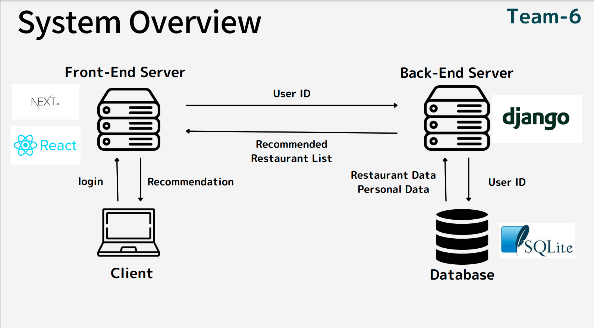
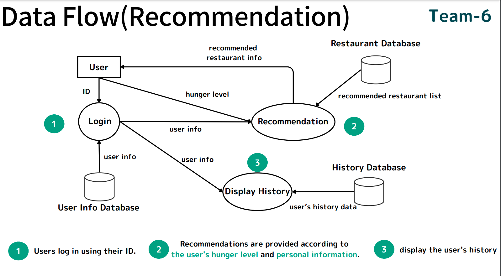
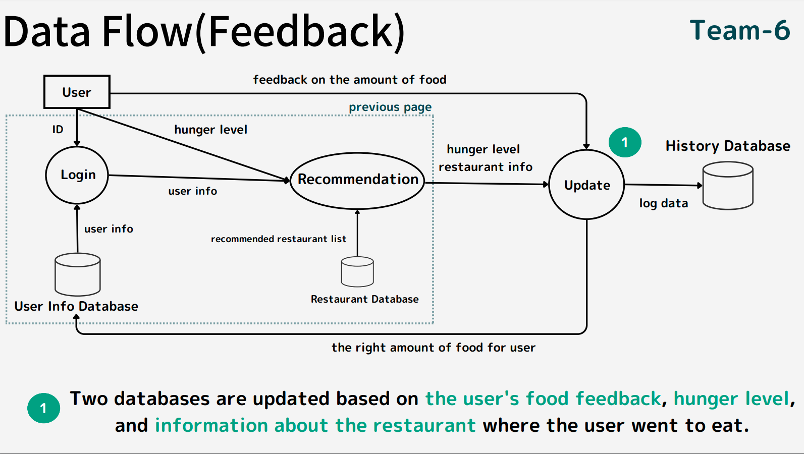

# FOOD WIZARD
An app that estimates a person's appropriate meal quantity based on their regular diet and recommends suitable restaurants.

## Getting Started
To run the backend server, create a virtual environment and install libraries. 
```
$ cd backend/server
$ python -m venv venv
$ source venv/bin/activate
$ pip install -r requirements.txt
```
run the backend server.
```
python manage.py --runserver
```

Next, run the frontend server in a separate terminal:
```bash
npm run dev
# or
yarn dev
# or
pnpm dev
```
Open [http://localhost:3000](http://localhost:3000) with your browser to see the result.

## Usage(Login)
Input "Oliver" as user ID. you don't need to input in Passward.


## System Over View


## Data Flow




